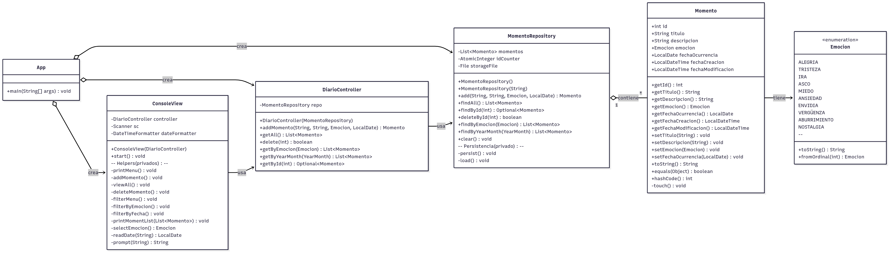
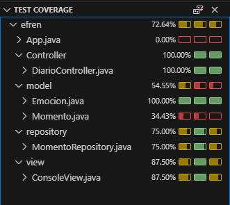

# Project Inside Out

## Instrucciones

Se os ha encargado la creación de una **aplicación de consola** con la cual el usuario podrá gestionar momentos vividos, llamada **Mi Diario**.  
Cada momento tendrá una emoción asignada junto con la fecha de cuando ocurrió.

Cada momento vivido tendrá:
- Un **identificador**
- Un **título**
- Una **descripción**
- Una **emoción**
- **Fecha del momento**
- **Fecha de creación**
- **Fecha de modificación**

### Listado de emociones

- Alegría  
- Tristeza  
- Ira  
- Asco  
- Miedo  
- Ansiedad  
- Envidia  
- Vergüenza  
- Aburrimiento  
- Nostalgia  

> Por cada historia de usuario se deberán redactar los **criterios de aceptación**.

---

## Historias de usuario

- COMO usuario QUIERO añadir un momento vivido PARA poder visualizarlo cuando lo necesite recordar  
- COMO usuario QUIERO recuperar la lista de los momentos vividos registrados PARA poder repasarlos  
- COMO usuario QUIERO suprimir un momento vivido PARA evitar duplicados y mantener la lista de momentos organizada  
- COMO usuario QUIERO obtener los momentos vividos según su emoción PARA poder visualizarlos  
- COMO usuario QUIERO obtener los momentos vividos en un mes determinado  
- COMO usuario QUIERO salir del programa PARA poder iniciar otro  

---

## Ejemplo de interacción con la consola

```
My diario:
1. Añadir momento
2. Ver todos los momentos disponibles
3. Eliminar un momento
4. Filtrar los momentos
5. Salir
Seleccione una opción: 1

Ingrese el título: Un día en el parque de atracciones
Ingresa la fecha (dd/mm/year): 01/05/2024
Ingrese la descripción: Lorem ipsum dolor sit amet, consectetur adipiscing elit. Vivamus sed eros vel massa scelerisque convallis interdum ut purus.

Selecciona una emoción:
1. Alegría
2. Tristeza
3. Ira
4. Asco
5. Miedo
6. Ansiedad
7. Envidia
8. Vergüenza
9. Aburrimiento
10. Nostalgia
Ingrese su opción: 1
Momento vivido añadido correctamente.

My diario:
1. Añadir momento
2. Ver todos los momentos disponibles
3. Eliminar un momento
4. Filtrar los momentos
5. Salir
Seleccione una opción: 2

Lista de momentos vividos:
1. Ocurrió el: 01/01/2024. Título: Un día en el parque de atracciones. Descripción: Lorem ipsum dolor sit amet, consectetur adipiscing elit. Vivamus sed eros vel massa scelerisque convallis interdum ut purus. Emoción: Alegría

My diario:
1. Añadir momento
2. Ver todos los momentos disponibles
3. Eliminar un momento
4. Filtrar los momentos
5. Salir
Seleccione una opción: 3

Ingresa el identificador del momento: 1
Momento vivido eliminado correctamente.

My diario:
1. Añadir momento
2. Ver todos los momentos disponibles
3. Eliminar un momento
4. Filtrar los momentos
5. Salir
Seleccione una opción: 4

Filtrar por ...:
1. Emoción
2. Fecha
Ingrese una opción: 1

Selecciona una emoción:
1. Alegría
2. Tristeza
3. Ira
4. Asco
5. Miedo
6. Ansiedad
7. Envidia
8. Vergüenza
9. Aburrimiento
10. Nostalgia
Ingrese su opción: 1

Lista de momentos vividos:
1. Ocurrió el: 01/01/2024. Título: Un día en el parque de atracciones. Descripción: Lorem ipsum dolor sit amet, consectetur adipiscing elit. Vivamus sed eros vel massa scelerisque convallis interdum ut purus. Emoción: Alegría

My diario:
1. Añadir momento
2. Ver todos los momentos disponibles
3. Eliminar un momento
4. Filtrar los momentos
5. Salir
Seleccione una opción: 4

Filtrar por ...:
1. Emoción
2. Fecha
Ingrese una opción: 2

Ingrese la fecha (dd/mm/year): 01/01/2024

Lista de momentos vividos:
1. Ocurrió el: 01/01/2024. Título: Un día en el parque de atracciones. Descripción: Lorem ipsum dolor sit amet, consectetur adipiscing elit. Vivamus sed eros vel massa scelerisque convallis interdum ut purus. Emoción: Alegría

My diario:
1. Añadir momento
2. Ver todos los momentos disponibles
3. Eliminar un momento
4. Filtrar los momentos
5. Salir
Seleccione una opción: 5

Hasta la próxima!!!
```

---

## Rúbrica de evaluación

### Interfaz de usuario
- La interfaz de usuario permite **añadir** (10%)  
- La interfaz de usuario permite **visualizar todos los momentos** (10%)  
- La interfaz de usuario permite **eliminar un momento** (10%)  
- La interfaz de usuario permite **filtrar por emoción** (10%)  
- La interfaz de usuario permite **filtrar por fecha** (10%)  

### Persistencia de datos
- Se hace un uso adecuado de la interfaz `List<E>` (10%)  

### Código y buenas prácticas
- Tests de cobertura mínimo un 70% (20%)  
- El código está bien estructurado (10%)  
- Correcta separación de responsabilidades (S de SOLID) (10%)


## Pre-requisitos

Antes de ejecutar el proyecto, asegúrate de tener instalados los siguientes elementos:

- [Java JDK 21](https://www.oracle.com/java/technologies/javase/jdk21-archive-downloads.html)
- [Apache Maven 3.9+](https://maven.apache.org/download.cgi)  
- Un editor de código recomendado: [Visual Studio Code](https://code.visualstudio.com/)
- Extensiones necesarias para VSCode: Debugger for Java, Extension Pack for Java, Language Support for Java, Maven for Java, Project Manager for Java, Test Runner for Java
- Git (para clonar el repositorio)

> Verifica la instalación ejecutando en la terminal:
> ```bash
> java -version
> mvn -version
> ```

---

##  Pasos para la instalación

1. **Clonar el repositorio**
   ```bash
   git clone https://github.com/EfrenTC/inside-out


---

##  Diagrama de clases




##  Test Coverage

